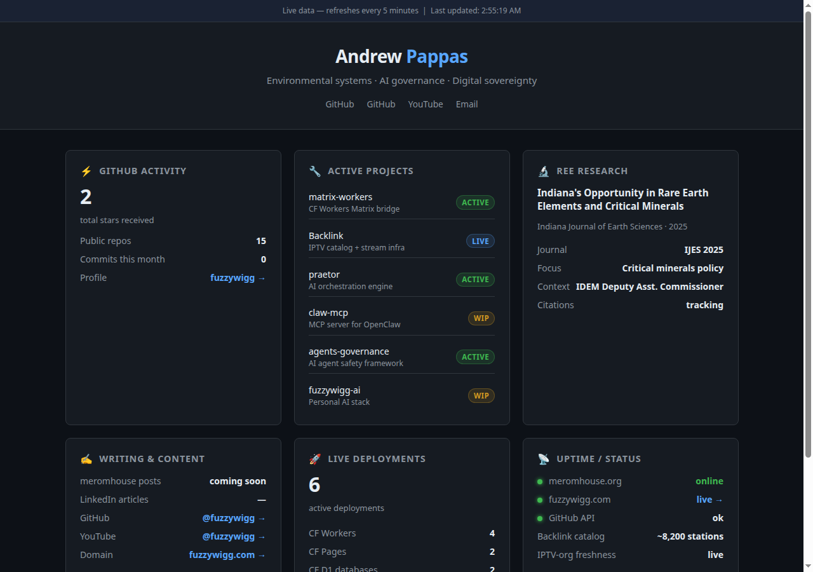
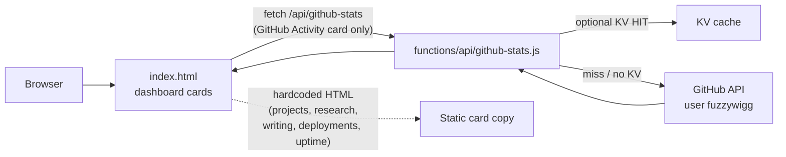

# meromhouse

[](https://github.com/fuzzywigg/meromhouse/actions/workflows/ci.yml)

> Andrew Pappas, building in public.

Canonical source for [meromhouse.org](https://meromhouse.org), Andrew Pappas's public KPI dashboard. Shows active projects, GitHub activity, research output, and deployment status.

## Cloud agents

Bootstrap lives in [`.cursor/environment.json`](.cursor/environment.json) (`install` verifies keeper files; `start` runs `wrangler pages dev` — no secrets in the file). PR CI is [`.github/workflows/ci.yml`](.github/workflows/ci.yml). DNS / custom-domain leftover cleanup stays HITL (issue #4). Deploy walkthrough: [DEPLOY.md](./DEPLOY.md).

## Repository Status

- Keeper repo: `fuzzywigg/meromhouse`
- Retired repo: `fuzzywigg/meromhouse.org`
- Production host: Cloudflare Pages project `meromhouse`
- Live production URL: `https://meromhouse.org`

The former `meromhouse.org` Next.js repo was folded into this repo on 2026-07-18. Durable governance notes, release process, favicon, and manifest assets were preserved here. Development should happen in this repo only.

## Stack

- Cloudflare Pages (hosting, zero cost)
- CF Pages Functions (github-stats API, auto-cached)
- Vanilla HTML/CSS/JS (zero dependencies, fast)

## Dashboard (live)



*Live capture from [meromhouse.pages.dev](https://meromhouse.pages.dev) (same Pages project as meromhouse.org).*

## How it works



## Data Sources

| Source | Status | Card |
|--------|--------|------|
| GitHub API | Live fetch | GitHub Activity |
| Hardcoded in `index.html` | Static | Active Projects, REE Research |
| Hardcoded / manual edit | Static | Writing, Deployments, Uptime |
| CF Analytics | Planned (not wired) | Page views |
| Google Search Console | Planned (not wired) | SEO impressions |
| X API | Planned (not wired) | Followers |
| YouTube API | Planned (not wired) | Subscribers |

Only the GitHub Activity card calls a Pages Function. Everything else is copy in `index.html` until those Planned sources are wired.

## Deploy

See [DEPLOY.md](./DEPLOY.md) for the full setup walkthrough.

## File Structure

```
meromhouse/
├── index.html          # Dashboard shell (dark theme, 6 data cards)
├── functions/api/
│   ├── github-stats.js # CF Pages Function — GitHub data aggregator
│   └── health.js       # CF Pages Function — health check
├── public/             # Favicon assets retained from retired Next app
├── docs/               # Governance, release, screenshots
├── .cursor/
│   └── environment.json # Cloud agent install/start (static + wrangler)
├── site.webmanifest    # PWA manifest (icons under /public/)
├── _headers            # CF Pages security headers
├── _redirects          # CF Pages URL rewrites
├── wrangler.toml       # Local dev config
├── DEPLOY.md           # Setup walkthrough
└── AGENTS.md           # Agent governance
```

## Part of the smtp.eth ecosystem

Built by Geryon 🦀 for [fuzzywigg](https://github.com/fuzzywigg).
