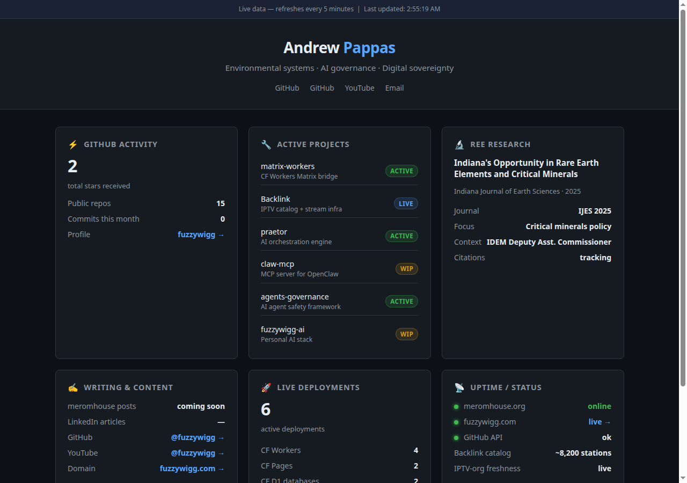
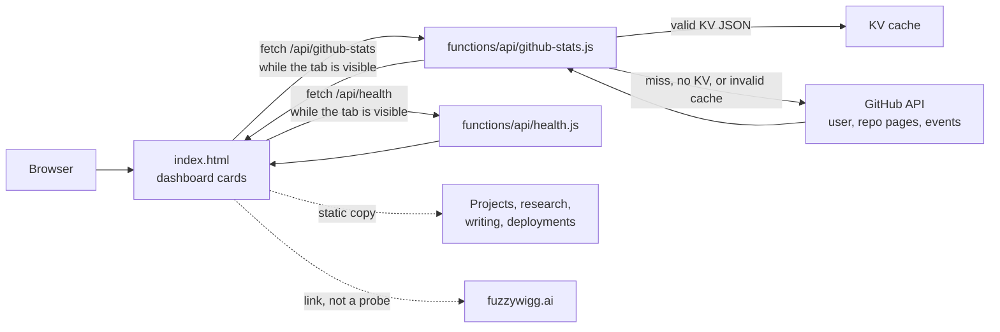

# meromhouse

[](https://github.com/fuzzywigg/meromhouse/actions/workflows/ci.yml)

> Andrew Pappas, building in public.

Canonical source for [meromhouse.org](https://meromhouse.org), Andrew Pappas's public KPI dashboard. Shows active projects, GitHub activity, research output, and deployment status.

## Cloud agents

Bootstrap lives in [`.cursor/environment.json`](.cursor/environment.json) (`install` verifies keeper files; `start` runs `wrangler pages dev` — no secrets in the file). PR CI is [`.github/workflows/ci.yml`](.github/workflows/ci.yml). DNS / custom-domain leftover cleanup stays HITL (issue #4). Deploy walkthrough: [DEPLOY.md](./DEPLOY.md).

## Repository Status

- Keeper repo: `fuzzywigg/meromhouse`
- Retired repo: `fuzzywigg/meromhouse.org`
- Production host: Cloudflare Pages project `meromhouse`
- Live production URL: `https://meromhouse.org`

The former `meromhouse.org` Next.js repo was folded into this repo on 2026-07-18. Durable governance notes, release process, favicon, and manifest assets were preserved here. Development should happen in this repo only.

## Stack

- Cloudflare Pages (hosting, zero cost)
- CF Pages Functions (github-stats API; optional KV cache when bound)
- Vanilla HTML/CSS/JS (zero dependencies, fast)

## Dashboard (live)



*Live capture from [meromhouse.pages.dev](https://meromhouse.pages.dev) (same Pages project as meromhouse.org).*

## How it works


```mermaid
flowchart LR
  Browser["Browser"] --> Index["index.html<br/>dashboard cards"]
  Index -->|"fetch /api/github-stats<br/>while the tab is visible"| GhFn["functions/api/github-stats.js"]
  GhFn -->|"valid KV JSON"| KV["KV cache"]
  GhFn -->|"miss, no KV, or invalid cache"| GH["GitHub API<br/>user, repo pages, events"]
  GH --> GhFn
  GhFn --> Index
  Index -->|"fetch /api/health<br/>while the tab is visible"| Health["functions/api/health.js"]
  Health --> Index
  Index -.->|"static copy"| Static["Projects, research,<br/>writing, deployments"]
  Index -.->|"link, not a probe"| Hub["fuzzywigg.ai"]
```

Both live polls use a 5-minute interval and pause on `visibilitychange` when `document.hidden` is true (no background polling). When the tab is visible again, each poll runs once immediately, then the interval restarts.

## Data Sources

| Source | Status | Card |
|--------|--------|------|
| GitHub API via `/api/github-stats` | Live. Upstream fetches time out. Partial repos/events failure returns `partial: true` (not cached in KV). Invalid, partial, or age-stale KV entries (by `cached_at` vs one-hour TTL) are rejected. The card shows `ok`, `partial`, or `unavailable`. Polling pauses while the tab is hidden. | GitHub Activity |
| `/api/health` | Live same-origin fetch every 5 minutes while the tab is visible; paused when the tab is hidden. Client 10s timeout. `Cache-Control: no-store`. Optional KV probe → `degraded` on timeout/error; `checks.kv` is `unbound` when KV is not bound. | Uptime: meromhouse.org (`online`, `degraded`, or `error`, with `updated`) |
| Not probed from the browser | Link only | Uptime: fuzzywigg.ai |
| Hardcoded in `index.html` | Static | Active Projects, REE Research |
| Hardcoded / manual edit | Static | Writing, Deployments |
| CF Analytics | Planned (not wired) | Page views |
| Google Search Console | Planned (not wired) | SEO impressions |
| X API | Planned (not wired) | Followers |
| YouTube API | Planned (not wired) | Subscribers |

GitHub Activity calls `/api/github-stats`. KV hits older than the one-hour TTL (by `cached_at`) are rejected and refetched. The client also treats an age-stale `cached_at` as unavailable. Both polls use a generation + `AbortController` gate (plus a 10s timeout) so a visibility hide/show race does not paint a superseded response or flash unavailable on abort. The Uptime card calls `/api/health` for meromhouse.org and keeps a text state next to the dot. Both polls pause while the tab is hidden. fuzzywigg.ai is a link, not a browser check. The other cards are copy in `index.html`.

## Deploy

See [DEPLOY.md](./DEPLOY.md) for the full setup walkthrough.

## Tests

```bash
npm ci
npm test                 # Node unit tests (Pages Functions + index.html shell)
npx playwright install chromium
npm run test:e2e         # Playwright smokes: refresh-bar honesty, /api/health row, a11y basics
```

Playwright starts `wrangler pages dev` itself (port 8790 by default). GitHub stats are route-mocked so CI does not call api.github.com; `/api/health` hits the real local Pages Function.

## File Structure

```
meromhouse/
├── index.html          # Dashboard shell (dark theme, 6 data cards)
├── functions/api/
│   ├── github-stats.js # CF Pages Function — GitHub data aggregator
│   └── health.js       # CF Pages Function — health check
├── test/
│   ├── *.test.js       # Node unit tests
│   └── e2e/            # Playwright dashboard smokes
├── public/             # Favicon assets retained from retired Next app
├── docs/               # Governance, release, screenshots
├── .cursor/
│   └── environment.json # Cloud agent install/start (static + wrangler)
├── package.json        # npm test + Playwright scripts
├── playwright.config.mjs
├── site.webmanifest    # PWA manifest (icons under /public/)
├── _headers            # CF Pages security headers
├── _redirects          # CF Pages redirects (no active rules; APIs under /api/*)
├── wrangler.toml       # Local dev config
├── DEPLOY.md           # Setup walkthrough
└── AGENTS.md           # Agent governance
```

## Part of the smtp.eth ecosystem

Built by Geryon 🦀 for [fuzzywigg](https://github.com/fuzzywigg).
